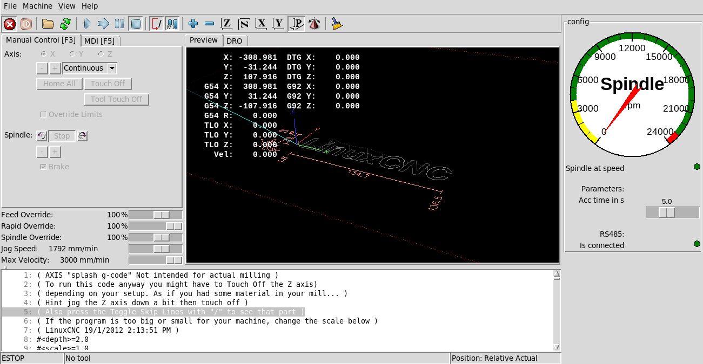

# LinuxCNC-Yalang-yl620-VFD-rs485-Modbus-ClassicLadder

### About

This repository should help users to integrate the YL620 VFD using Modbus RS485 into LinuxCNC. This integration is based on ClassicLadder. In my other [repository](https://github.com/xsnoopy/LinuxCNC-Yalang-yl620-VFD-rs485-Modbus---VFDmod) 
I am using VFDmod, but I would suggest stay as much as you can with standard components of LinuxCNC. I believe as well that with ClassicLadder you should be able to use other Modbus devices at the same time. It seems to be possible, to use the X1-X8 Terminals of the VFD as field Inputs. But since I don’t have a use for that, I haven’t bothered with it. Leave a pull request and I might integrate that as well. 

### How to

- Set up the VFD drive to receive signals via Modbus. 
  - P00.01 = 3  Start/Stop command source RS485
  - P03.00 = 4  for 19200Bps
  - P03.01 = 1  RS485 slave address 1
  - P03.02 =  2  Data transfer format 8 bit data, 1 stop bit, no parity
  - P07.08 =  5  Frequency source selection RS 485
- Connect the VFD with your USB Rs485 adapter.
- Download vdf.hal vfd.clp and vfd.xml to your linuxcnc/config/NAME folder. Replace NAME with the name of your machine. 
- Add this to "YOUR_MACHINE.Hal" file at the end
=============================================================================================
loadrt classicladder_rt numS32out=100
addf classicladder.0.refresh servo-thread
loadusr classicladder --modmaster vfd.clp
net spindle-on          classicladder.0.in-00   spindle.0.on
net spindle-brake       classicladder.0.in-01   spindle.0.brake
net spindle-forward     classicladder.0.in-02   spindle.0.forward
net spindle-reverse     classicladder.0.in-03   spindle.0.reverse
net spindle-cmd-rpm     <= spindle.0.speed-out
net spindle-cmd-rpm-abs <= spindle.0.speed-out-abs
net spindle-cmd-rps     <= spindle.0.speed-out-rps
net spindle-cmd-rps-abs <= spindle.0.speed-out-rps-abs classicladder.0.floatin-00
=============================================================================================

- Add this to your machines "YOUR_MACHINE.ini" file in the relevant sections

under the [DISPLAY] section add
=============================================================================================
PYVCP = vfd.xml
=============================================================================================
and in the [HAL] section add
=============================================================================================
POSTGUI_HALFILE = vfd.hal
============================================================================================= 
 - Set up classic ladder with the settings from these images in the 
 
  
 
 

also for people using a usb adapter that has the name /dev/ttyACM0 and hasnt added their user to the DIALOUT usergroup whis is need to get this working or configured thier adapter in linux this should help you out

https://www.waveshare.com/usb-to-rs485.htm

also to point out if you use the usb to r485 adapter linked above or any other adapter that shows up as /dev/ttyACMO as the classicladder configuration tab doesnt have this as a selectable option 
so to remedy this open the vfd.clp file towards the bottom you should see this text

MODBUS_MASTER_SERIAL_PORT=/dev/ttyUSB0
MODBUS_MASTER_SERIAL_SPEED=19200
MODBUS_MASTER_SERIAL_DATABITS=8
MODBUS_MASTER_SERIAL_STOPBITS=1
MODBUS_MASTER_SERIAL_PARITY=0
MODBUS_ELEMENT_OFFSET=0
MODBUS_MASTER_SERIAL_USE_RTS_TO_SEND=0
MODBUS_MASTER_TIME_INTER_FRAME=100
MODBUS_MASTER_TIME_OUT_RECEIPT=500
MODBUS_MASTER_TIME_AFTER_TRANSMIT=100
MODBUS_DEBUG_LEVEL=0
MODBUS_MAP_COIL_READ=0
MODBUS_MAP_COIL_WRITE=1
MODBUS_MAP_INPUT=0
MODBUS_MAP_HOLDING=0
MODBUS_MAP_REGISTER_READ=1
MODBUS_MAP_REGISTER_WRITE=0
_/FILE-com_params.txt

MODBUS_MASTER_SERIAL_PORT=/dev/ttyUSB0

(this is the line that needs editing with /dev/ttyACM0)

edit the text and save the file

when you open linuxcnc and open up the config window in classicladder you will see it has changed to/dev/ttyACM0 and it will now work
also i set the vfd to 19200 8 n 1 and kept the same in the the classicladder config tab to get mine working,

also you need to add your user to the dialout group and configure your usb adapter to the correct setting

to add user to dialout group open a terminal and type this command

sudo adduser "YOUR USERNAME" dialout

then check groups for your user with this command

sudo groups "YOUR USERNAME"

and it will list the groups your username is added to

and to configure the usb adapter i installed an app called GTKTERM by again opening a terminal and typing this command

sudo apt-get install gtkterm

when installed go to application and under accessories should now be a new application called "serial port terminal"
open it up and on the configuration tab you can now change and save a permanent configuration for your adapter and any other adapter you are 
using. this way i had a solid connection as some people were complaining about the vfd being noisy and dropping connection, 
so they gave up using the rs485 method but im not using a shielded cable from the rs485 port on the vfd, it is a jst-xh 3 pin male cable thats about 20cm long. 
DO NOT and i repeat DO NOT BY ANY MEANS use a usb extention cable. the adapter came with a cable that has a built in ferrite and is also shielded but if i used it, 
as soon as i send a command to linuxcnc the connection would drop straight away. so if your trying to get this method working DONT use an extention cable for the usb adapter. 
also buy the adapter i listed above as people were sayin they had to use resistors to negate noise from the vfd signal to the adapter but this has them on the adapter 
pcb and is also lighting proof according to the specs. i tried a cheap usb adapter previously but due to a noisy signal couldnt get that working, you may be lucky 
but the setup is problematic enough without adding caveats yourself.

 

